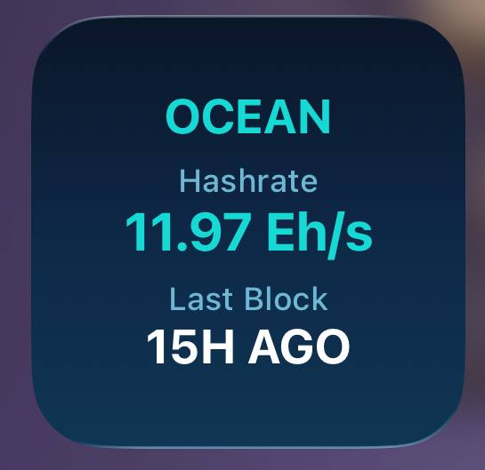

# Ocean Mining Widget

Displays OCEAN pool mining statistics including hashrate and time since last block was found.



## Features
- OCEAN pool logo
- Current pool hashrate in Eh/s
- Time since last block found
- Ocean-inspired gradient background (deep navy to cyan)
- Cyan accent colors matching ocean.xyz branding
- Auto-refresh every 60 seconds

## Tutorial

1. Install the app "Scriptable" -> [Apple Appstore - Scriptable](https://apps.apple.com/ch/app/scriptable/id1405459188?l=en)
2. Open the app and click the "+" sign on the top right corner
3. Paste the following script:

```js
// Variables used by Scriptable.
// These must be at the very top of the file. Do not edit.
// icon-color: blue; icon-glyph: water;
// OCEAN Mining Pool Widget
// Displays hashrate and last block time from ocean.xyz

// Fetch OCEAN logo
let logoReq = new Request('https://ocean.xyz/static/assets/home/symbol.svg');
let logoImage;
try {
  logoImage = await logoReq.loadImage();
} catch(e) {
  logoImage = null;
}

// Fetch pool status data
let hashrate = "N/A";
let lastBlock = "N/A";

try {
  let req = new Request('https://ocean.xyz/template/poolstatus');
  let html = await req.loadString();
  
  // Parse hashrate (e.g., "11.43 Eh/s")
  let hashrateMatch = html.match(/HASHRATE:\s*([\d.]+\s*[EPT]h\/s)/i);
  if (hashrateMatch) {
    hashrate = hashrateMatch[1].trim();
  } else {
    // Fallback: try alternate pattern
    let altMatch = html.match(/([\d.]+)\s*Eh\/s/i);
    if (altMatch) {
      hashrate = altMatch[1] + " Eh/s";
    }
  }
  
  // Parse last block time (e.g., "14H AGO")
  let blockMatch = html.match(/BLOCK[:\s]*[\d]*\s*\(([^)]+)\)/i);
  if (blockMatch) {
    lastBlock = blockMatch[1].trim();
  } else {
    // Fallback: try alternate pattern
    let altBlockMatch = html.match(/BLOCK:\s*(\d+[HMD]\s*AGO)/i);
    if (altBlockMatch) {
      lastBlock = altBlockMatch[1].trim();
    }
  }
} catch(e) {
  console.log("Error fetching OCEAN data: " + e);
}

let widget = await createWidget();

// Check where the script is running
if (config.runsInWidget) {
  Script.setWidget(widget);
} else {
  widget.presentSmall();
}

Script.complete();

async function createWidget() {
  let listwidget = new ListWidget();
  
  // Refresh every 60 seconds
  let nextRefresh = Date.now() + 1000 * 60;
  listwidget.refreshAfterDate = new Date(nextRefresh);
  
  // OCEAN gradient background (inspired by ocean.xyz branding)
  // Gradient from deep blue (#1137F5) through medium blue (#1489EE) to cyan (#17D9D5)
  let gradient = new LinearGradient();
  gradient.locations = [0, 0.5, 1];
  gradient.colors = [
    new Color("#0a1628"),    // Dark navy base
    new Color("#0d2847"),    // Mid dark blue
    new Color("#0f3654")     // Slightly lighter with cyan tint
  ];
  listwidget.backgroundGradient = gradient;
  
  // Add OCEAN logo
  if (logoImage) {
    let logo = listwidget.addImage(logoImage);
    logo.imageSize = new Size(40, 40);
    logo.centerAlignImage();
  } else {
    let title = listwidget.addText("OCEAN");
    title.centerAlignText();
    title.font = Font.boldSystemFont(18);
    title.textColor = new Color("#17D9D5");
  }
  
  listwidget.addSpacer(6);
  
  // Hashrate section
  let hashTitle = listwidget.addText("Hashrate");
  hashTitle.centerAlignText();
  hashTitle.font = Font.mediumSystemFont(12);
  hashTitle.textColor = new Color("#6eb8d4");  // Muted cyan
  
  let hashValue = listwidget.addText(hashrate);
  hashValue.centerAlignText();
  hashValue.font = Font.boldSystemFont(20);
  hashValue.textColor = new Color("#17D9D5");  // OCEAN cyan accent
  
  listwidget.addSpacer(6);
  
  // Last Block section
  let blockTitle = listwidget.addText("Last Block");
  blockTitle.centerAlignText();
  blockTitle.font = Font.mediumSystemFont(12);
  blockTitle.textColor = new Color("#6eb8d4");  // Muted cyan
  
  let blockValue = listwidget.addText(lastBlock);
  blockValue.centerAlignText();
  blockValue.font = Font.boldSystemFont(18);
  blockValue.textColor = new Color("#FFFFFF");
  
  return listwidget;
}
```

4. Click on the bottom left corner the "sliders" to name your script. For example: Ocean
5. Click close and done
6. Go to the homescreen, press and hold for a few seconds to make the icons move. Tap on the top left corner the "+" symbol


7. Scroll down until you find the "Scriptable" App. Select it and choose the small widget size.


8. Click "Add Widget" and tap the new created widget to edit it. Select the created script and you're done!


## Data Source

Data is fetched from [ocean.xyz](https://ocean.xyz) pool statistics.


